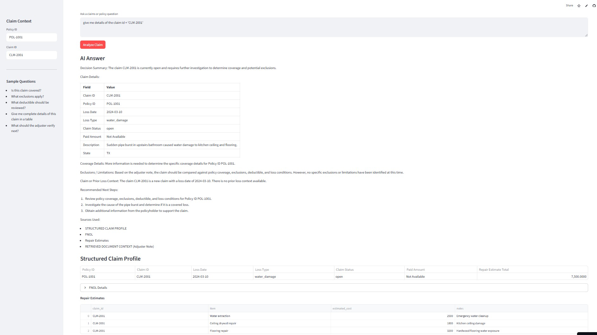

# Claims & Policy Intelligence Platform

A portfolio project for Property & Casualty insurance demonstrating an end-to-end Retrieval-Augmented Generation (RAG) application using LangChain, FAISS, OpenAI, and Streamlit.

## Business Use Case
This application helps claims adjusters and underwriters quickly retrieve coverage details, exclusions, deductible information, and prior claim context from insurance documents such as policies, FNOL reports, adjuster notes, and underwriting guidelines.

## Tech Stack
- Python
- Streamlit
- LangChain
- Hugging Face (Embeddings)
- FAISS (Vector Search)
- Groq API (LLM)
- RAGAS

## Key Concepts

- **FNOL (First Notice of Loss):** The initial report of a claim submitted by the insured.
- **RAG (Retrieval-Augmented Generation):** Combines document retrieval with LLM responses.
- **Vector Search:** Enables semantic search using embeddings.

## Architecture (High Level)

```text
Data Sources
(PDFs, FNOL JSON, Notes, Guidelines)
        ↓
Ingestion Pipeline
        ↓
Document Normalization
        ↓
(Next Steps)
Chunking → Embeddings → FAISS → RAG → Streamlit UI

## Streamlit Demo


